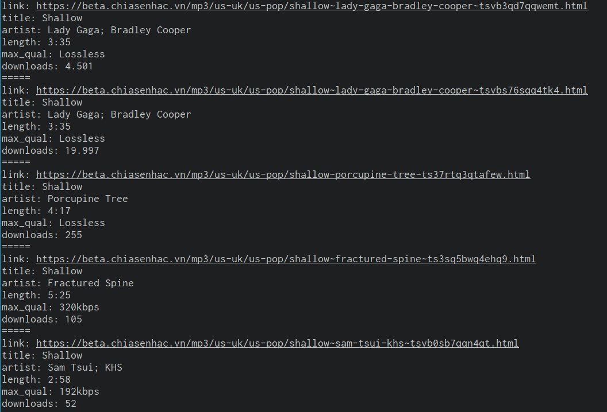

# Description
* A WIP C library for fetching data from [chiasenhac.com](http://chiasenhac.com)
* Built upon [libcurl](https://curl.haxx.se), [json-c](https://github.com/json-c/json-c) and [libxml2](https://gitlab.gnome.org/GNOME/libxml2)

## Features
* Searching for audio/video/album
* Fetching hot/trending song list
* Get download link for audio/video/album

## APIs that work so far
- [x] csn_search
- [ ] csn_fetch_music_info_url
- [ ] csn_fetch_album_info_url
- [ ] csn_fetch_music_info
- [ ] csn_fetch_album_info

## Build
Make sure you have `libcurl`, `json-c` and `libxml2` development packages is available, then run
```sh
$ meson build
$ cd build && ninja
```

## Demo
```sh
$ cd build
$ ./demo "shallow"
```
The result should look like this


## Run tests
```sh
$ ninja test
```

## Documentations
Check [Wiki](https://github.com/l4rzy/csn/wiki)

## Licence
MIT
